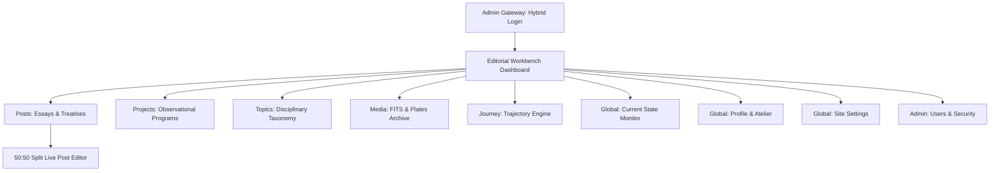

# ZeroAbstraction Admin Dashboard: Analysis & Implementation Specification

> **Source**: Generated from Google Stitch Design System Prototypes (`google-stitch-dashboard/stitch_zeroabstraction_admin_dashboard`)  
> **Platform**: Next.js 15 (App Router) + Payload CMS 3.x + PostgreSQL  
> **Target**: Single-Operator Personal Observatory Atelier (`zeroabstraction.org`)

---

## Executive Summary

A comprehensive architectural and visual analysis was conducted on the **Google Stitch** dashboard export located at `google-stitch-dashboard/stitch_zeroabstraction_admin_dashboard`. The directory serves as the definitive design reference and contains **3 design specifications**, **6 high-resolution scientific and portrait visual assets**, and **21 UI screen prototypes** across all collections and globals of the ZeroAbstraction platform.

This document details the extracted **design theme**, **visual elements and design tokens**, the **asset mapping for all images**, and a **screen-by-screen implementation roadmap** to construct the admin dashboard.

---

## 1. Design Theme: Observatory Editorial Engine

The visual identity synthesizes two core paradigms:
1. **Literary Broadsheet Publishing**: Inspired by long-form academic journals (*The Paris Review*, *Aperture*, *Aeon*), incorporating unhurried typography, tactile paper textures, wide margins, and high-contrast carbon ink.
2. **Scientific Telemetry & Radio Astronomy**: Inspired by astrophysical darkroom consoles, interferometer contour plots, FITS plate metadata, UTC time standards, and ASCOM hardware drivers.

```
+-----------------------------------------------------------------------------------+
|                           OBSERVATORY EDITORIAL ENGINE                            |
+-----------------------------------------+-----------------------------------------+
|     Tactile Archival Broadsheet         |      Astrophysical Radio Telemetry      |
|  - Unbleached parchment (#FBFBFA)       |  - Cosmic darkroom canvas (#0B1114)     |
|  - Newsreader editorial display serif   |  - JetBrains Mono coordinates & epochs  |
|  - Slated carbon ink (#181C1E)          |  - Instrument bronze accents (#D49A68)  |
|  - Sharp 0px–4px architectural edges    |  - Hairline 1px structural boundaries   |
+-----------------------------------------+-----------------------------------------+
```

### Aesthetic Pillars

- **Dual-Atmosphere Modes**:
  - **Daylight Atelier (Light Theme / Primary Admin Default)**: Built on tactile paper grounds (`#FBFBFA`, `#F4F4F0`, `#EAEAE5`), crisp slate inks (`#181C1E`, `#2D3134`), and warm instrument amber accents (`#B3743B`, `#965A26`).
  - **Cosmic Charcoal (Dark Theme / Night Console)**: Built on deep-sky charcoal (`#0B1114`, `#0E1417`), 1px structural hairline rules (`#2A3032`), and unbleached warm archival white ink (`#F1ECE2`).
  - **Hybrid Login Gateway**: A dual composition featuring a dark cosmic grid on the left juxtaposed against an archival parchment credential card on the right.
- **Architectural Planarity**: Discards conventional soft drop shadows, synthetic blurs, and skeuomorphic gradients. Spatial hierarchy is defined purely through **tonal surface layering** and **crisp 1px hairline rules**.
- **Sharp Geometry**: Strict **0px to 4px crisp corner radiuses** across action buttons, cards, drawers, form inputs, and status chips, evoking optical reticles, microfiche apertures, and broadsheet newspaper columns.

---

## 2. Design Tokens & Visual Elements

### 2.1 Color Palette Hierarchy

| Functional Role | Daylight Atelier (Light) | Cosmic Charcoal (Dark) | Description & Component Application |
| :--- | :--- | :--- | :--- |
| **Canvas Base** | `#FBFBFA` / `#FAF9F5` | `#0B1114` | Atmospheric root viewport background |
| **Surface Level 1** | `#F4F4F0` | `#0E1417` | Sidebars, sticky header rails, document sheets |
| **Surface Container** | `#EAEAE5` / `#EEEEEA` | `#1A2123` | Table row hover, elevated metric cards, modal dialogs |
| **Recessed Well** | `#FFFFFF` | `#090F12` | Active code editors, prose writing areas, input wells |
| **Hairline Rules** | `#E0E0DB` | `#2A3032` | 1px architectural dividers, grid lines, table rules |
| **Hairline Subtle** | `#ECECE6` | `#1D2326` | Secondary inner card separators, metadata dividing ticks |
| **Ink (Primary)** | `#181C1E` | `#F1ECE2` | Primary headlines, monograph titles, reading text |
| **Ink (Secondary)** | `#2D3134` | `#A7A49D` | Author bylines, field descriptions, telemetry values |
| **Ink (Muted)** | `#686C6F` | `#5C6264` | Column headers, structural paths, disabled triggers |
| **Instrument Accent** | `#B3743B` / `#D49A68` | `#D49A68` | Primary CTA buttons, focus bounding boxes, active nav bars |
| **Accent Ochre / Hover** | `#965A26` | `#BC8353` | Focused interactive states, links, highlighted values |
| **Amber Wash** | `#F6EEE3` | `rgba(212,154,104,0.08)` | Selected row background, active pill highlights, badge wash |
| **Operational Green** | `#3D7A5A` / `#059669` | `#3D7A5A` | Real-time database pulse, 0ms lag beacon, online indicators |

### 2.2 Typographic Hierarchy

The system enforces three distinct typographic domains:

```
+-----------------------------------------------------------------------------------+
| TYPOGRAPHY DOMAIN    | FONT FAMILY     | ROLES & USAGE                            |
+----------------------+-----------------+------------------------------------------+
| 1. Editorial Display | Newsreader      | Monograph headlines, collection roots,   |
|                      | (Italic Serif)  | chapter headers, archive titles          |
| 2. Reading Prose     | IBM Plex Sans   | Essay drafting body, input fields,       |
|                      | (Humanist Sans) | descriptions, operational UI copy        |
| 3. Telemetry & Data  | JetBrains Mono  | Celestial coordinates (RA/Dec), epochs,  |
|                      | (Monospace)     | UTC clocks, schema IDs, math parameters  |
+----------------------+-----------------+------------------------------------------+
```

- **Editorial Display (`Newsreader`)**:
  - `headline-xl`: 3.5rem (56px) / Line height 4rem. Primary collection banners.
  - `headline-lg`: 2.5rem (40px) / Line height 3rem. Screen titles, welcome headers.
  - `headline-md`: 1.75rem (28px) / Line height 2.25rem. Section titles, monograph card titles.
  - `headline-sm`: 1.25rem (20px) / Line height 1.75rem. Card headlines, sub-headers.
- **Reading Prose (`IBM Plex Sans`)**:
  - `body-lg`: 1.125rem (18px) / Line height 1.875rem. Introductory abstracts, lead paragraphs.
  - `body-md`: 0.9375rem (15px) / Line height 1.5rem. Standard form fields, body text, table content.
  - `body-sm`: 0.8125rem (13px) / Line height 1.25rem. Secondary instructions, helper copy.
- **Telemetry & Indexing (`JetBrains Mono` / `Space Mono`)**:
  - `label-lg`: 0.8125rem (13px) / Line height 1.125rem / Tracking `0.06em`. Primary button labels, status metrics.
  - `label-md`: 0.6875rem (11px) / Line height 1rem / Tracking `0.08em`. Form field labels, table headers.
  - `label-sm`: 0.625rem (10px) / Line height 0.875rem / Tracking `0.1em`. Micro-badges, celestial coordinates, timestamps.
  - **Rule**: `font-variant-numeric: tabular-nums` and uppercase tracking are mandatory for all telemetry blocks.

### 2.3 Micro-Components & Interactive Patterns

- **Segmented Filter Pills**:
  - Crisp zero-radius pill cluster (`All`, `Published`, `Drafts`, `In Review`, `Archived`).
  - Active state: `#FFFFFF` (light) or `#1A2123` (dark) with amber text and an amber wash badge displaying the record count.
- **Telemetry Placards**:
  - Integrated sub-bars directly below form inputs displaying character bounds (`104 / 320 chars`), arXiv DOI links, and Git commit hashes.
- **Geometric Selection Controls**:
  - Checkboxes: Strict 16×16px square, 0px border radius, filling `#B3743B` when checked.
  - Radios: 14×14px square rotated 45 degrees (`transform: rotate(45deg)`), filling solid bronze when active.
- **Active State Indicators**:
  - Table rows do not use drop shadows; on selection, they gain an amber wash background (`#F6EEE3`) and a solid 2px vertical amber indicator line (`border-left: 2px solid #B3743B`).

---

## 3. Visual Assets Inventory & Integration Mapping

The 6 high-resolution imagery assets in the prototype directory are mapped directly to their administrative dashboard roles:

| Asset Directory | Asset File | File Size | Description | Target UI Placement |
| :--- | :--- | :--- | :--- | :--- |
| `astrophotography_deep_sky_telescope_capture_of_gravitational_lensing_arc_around` | `screen.png` | 1.7 MB | Monochromatic deep sky capture of gravitational lensing arc around cluster Abell 1689 (`RA 48m 6s, -41° 18' 4"`). | **Dashboard**: Hero Recent Media Spotlight.<br>**Posts**: Reference plate header.<br>**Post Editor**: Fig. 1 plate. |
| `james_webb_nircam_infrared_deep_field_high_resolution_astrophotography_of` | `screen.png` | 1.3 MB | High-res JWST NIRCam infrared deep field revealing magnified background galaxies and caustics. | **Media Archive**: Primary FITS asset.<br>**Essays**: Astrophotometry treatise plate. |
| `minimalist_technical_telescope_optical_path_ray_tracing_diagram_geometric` | `screen.png` | 1.1 MB | Clean line-art geometric ray tracing schematic through telescope optical assemblies and detector focal planes. | **Projects**: Hardware instrumentation rig plate.<br>**Topics**: Instrumentation domain card. |
| `monochromatic_deep_space_astronomical_radio_astronomy_interferometer_contour` | `screen.png` | 1.8 MB | Radio astronomy interferometer synthesized dirty beam contour map with clean uv-coverage plots. | **Topics**: Two-column taxonomy inspector.<br>**Media**: Calibrated FITS contour asset. |
| `monochromatic_grayscale_astrophotography_scientific_telescope_capture_of_deep` | `screen.png` | 1.5 MB | Grayscale scientific telescope capture of deep space star fields and cosmic dust filaments. | **Login View**: Dark cosmic background backdrop.<br>**Posts**: Collection deck header. |
| `professional_candid_portrait_photograph_of_a_male_astrophysicist_and_software` | `screen.png` | 1.4 MB | Candid photograph of Manoj Amavasya ("Lead Observer / Chief Observer") in an observatory research facility. | **Profile Global**: Main portrait plate.<br>**Admin Header**: User avatar badge.<br>**Users**: Superadmin identity card. |

---

## 4. Implementation Specifications: All Screens



---

### 4.1 Hybrid Editorial Login Gateway (`/admin/login`)
- **Left Column (Cosmic Canvas)**:
  - Deep charcoal background (`#0B1013`) with subtle coordinate grid lines (`cosmic-grid`).
  - Monochromatic grayscale deep field astrophotography preview.
  - Editorial quote: *"Looking into the abyss of space is an exercise in stripping away all human abstraction."*
  - Live observatory station status: `Station Alpha // Epoch J2025.13 // 14:22 UTC`.
- **Right Column (Archival Credential Sheet)**:
  - Tactile light paper card (`#FAF9F5`, border `#E0E0DB`).
  - Clean username/email and password inputs with crisp 1px amber focus bounds.
  - Monospaced security note: `Encrypted JWT Session Auth · Single Operator Principal`.

---

### 4.2 Editorial Workbench Dashboard (`/admin`)
- **Station Master Banner**:
  - Contextual headline: `Good morning, Manoj`.
  - Sub-label: `Observatory Workbench • Station Alpha / Epoch J2025.13`.
  - Quick-action cluster: `[+ New Post ⌘N]`, `[New Project]`, `[Ingest Media]`.
- **4 Telemetry Metric Tiles**:
  1. *Treatises & Essays*: Total count (`18`), delta (`+2 this lunar cycle`), link to collection.
  2. *Celestial Programs*: Active engineering rigs (`12`, `4 active rigs`), JWST & Keck pipeline status.
  3. *FITS Plates & Assets*: Total indexed media (`156`, `4.82 GB indexed`), storage volume status.
  4. *Current State Live Monitor*: Real-time broadcasting excerpt with pulsing amber/green beacon, UTC time, and quick-update trigger.
- **Manuscript Registry Distribution Bar**:
  - Segmented visual progress bar showing exact percentages of Published (`66.7%`), Draft (`22.2%`), Staged (`5.5%`), and Archived (`5.6%`) records.
- **Split Workspace Layout**:
  - **Left Section (60%)**: Recent Activity stream showing last-edited manuscripts with user, timestamp, and status badges; plus a headless CLI prompt banner (`payload sync --rig=jwst`).
  - **Right Section (40%)**:
    - *Ready for Peer Release Spotlight*: Featured manuscript with word count verification (`4,820 / 5,000`), validated LaTeX equations (`14 / 14 OK`), and Quick Publish button.
    - *Recent Media Ingestion Spotlight*: Embedded preview of **Plate #A1689-ARC (Gravitational Lensing Arc)** with WCS coordinates, file size (`34.8 MB FITS`), and header inspection link.
    - *Storage Cadence*: PostgreSQL cluster connection status (`0ms lag`), full-text search index status (`100%`), and S3 volume utilization.

---

### 4.3 Essays & Treatises — Posts Collection (`/admin/collections/posts`)
- **Broadside Collection Header**:
  - Masthead: `Posts / Essays & Treatises` set in `Newsreader` italic.
  - Telemetry badge: `SCHEMA::POSTS_v2 · Live Ledger Auto-sync (12s ago)`.
  - Export action: `[ Export TSV / JSON ]`.
- **Fast Filter Toolbar**:
  - Segmented status tabs: `All (18)`, `Published (12)`, `Drafts (4)`, `Archived (2)`.
  - Search field with `⌘K` keyboard shortcut badge.
- **Data Table**:
  - Monospaced table headers (`TITLE & SLUG`, `TOPIC`, `WCS PLATE REF`, `WORDS`, `STATUS`, `EPOCH`).
  - Row hover highlighting with an amber left border indicator.
  - Embedded miniature preview plate for manuscripts with associated astrophotography.

---

### 4.4 50:50 Live Split Post Editor (`/admin/collections/posts/:id`)
- **Sub-Header Telemetry Strip**:
  - Breadcrumb trail with slug indicator (`/posts/interferometric-baseline-abell-1689`).
  - Document status badge: `DRAFT-049`, save latency (`0ms`), word counter (`3,420 words`), and math cell counter (`6 equations`).
  - Revision picker button (`12 revisions`).
- **Left Pane (Source Editor & Structured Blocks)**:
  - *Frontmatter Block*: Title, slug, abstract synopsis, and canonical date.
  - *Markdown Prose Blocks*: Scientific narrative writing area with syntax highlighting.
  - *KaTeX Math Cells*: LaTeX formula input with auto-compilation status (`Compiled OK`), syntax preview, and math parameter dictionary (`\theta_E`: Einstein Radius, `\kappa`: Convergence).
  - *Python / CASA Calibration Scripts*: Code block with syntax formatting for astronomical reduction scripts.
- **Right Pane (Live Observatory Reader Preview)**:
  - Real-time rendered paper broadsheet with `Newsreader` headings and `IBM Plex Sans` body.
  - Rendered KaTeX mathematical equations and embedded high-res plate figures with archival captions.

---

### 4.5 Projects & Observational Programs (`/admin/collections/projects`)
- **Engineering Rigs Catalog**:
  - Program categories: DSP & FPGA Pipelines, Optical Ray Tracing, Keck HIRES Pipelines, ASCOM Alpaca Drivers.
- **Parametric Filters**:
  - Multi-select filters for *Epoch Year* (`2025 Current`, `2024`, `2023`), *Lifecycle* (`In Development`, `Published`, `Concluded`), and *Discipline* (`Astrophysics`, `Instrumentation`, `Optics`).
  - Star toggle for featured projects.
- **Project Edit Sheet**:
  - Git repository link, publication DOI, live demo URL, architecture diagram attachment, and tech stack tags.

---

### 4.6 Taxonomy & Disciplinary Topics (`/admin/collections/topics`)
- **Asymmetrical Two-Column View**:
  - *Left Column (58%)*: Topic list table with node counts (`Astrophysics: 9`, `Theoretical Physics: 5`, `ECE & HW: 4`, `ML & Computation: 6`), active slug indicators, and quick-filter pills.
  - *Right Column (42%)*: Sticky Topic Inspector displaying canonical metadata, description, associated post list, and the **Radio Astronomy Interferometer Contour Map** graphic.

---

### 4.7 Media Management & Asset Archive (`/admin/collections/media`)
- **Asset Grid**:
  - Monochromatic astrophotography plates, FITS spectra, technical ray tracing schematics, and author portraits.
- **WCS Header & Telemetry Inspector**:
  - Displays Right Ascension (`RA`), Declination (`Dec`), Exposure Time, Instrument (`JWST NIRCam`, `VLT MUSE`, `Keck I`), and FITS photometric zero-points.
- **Storage Metrics**:
  - S3 volume gauge (`4.82 GB / 25.00 GB`) and PG Vector indexing status.

---

### 4.8 Current State — Real-Time Broadcast Singleton (`/admin/globals/current-state`)
- **Live Broadcast Beacon**:
  - Animated pulsing green/amber indicator: `ACTIVE BROADCAST (PUBLICLY VISIBLE)`.
  - UTC synchronization indicator: `Last synchronized: 14:22 UTC (38m ago)`.
- **The 4 Core Telemetry Inputs**:
  1. `01 // CURRENTLY STUDYING & RESEARCHING`: Theoretical physics papers, arXiv DOI link, character counter (`104 / 320`).
  2. `02 // CURRENTLY BUILDING & ENGINEERING`: Hardware instruments, firmware commits (`feat/esp32-stepper-accel`), ASCOM compliance tags.
  3. `03 // CURRENTLY READING & AUDITORY LOG`: Journal volume citations, reading progress meter (`84% read`), listening log accompaniment.
  4. `04 // CURRENTLY CONTEMPLATING & FORMULATING`: Open cosmological hypotheses, links to upcoming drafts (`#TR-088 Abell Caustic Inferences`).

---

### 4.9 Profile & Atelier — About Singleton (`/admin/globals/profile`)
- **Visual Lead Observer Plate**:
  - Displays the high-resolution candid portrait of Manoj Amavasya (`professional_candid_portrait.../screen.png`).
- **Curatorial Biography Form**:
  - Academic bio, authentic voice principles, primary research interests, laboratory equipment list, and colophon metadata.

---

### 4.10 Journey Archive — Chronological Trajectory Engine (`/admin/collections/journey`)
- **Monotonic Sequence Controller**:
  - Ordered milestones (`#01` through `#08`) enforcing chronological sequence from the present day back to early research.
  - Interactive reordering via drag handles (`drag_indicator`) and single-step buttons (`keyboard_arrow_up`, `keyboard_arrow_down`).
  - Immediate sequence index auto-saving (`All 8 milestones synced to sequence index`).
- **Milestone Cards**:
  - Epoch range tags (`2024 — PRESENT`, `2020 — 2023`, `2014 — 2019`).
  - Institution badge, milestone summary, and linked treatise references.

---

### 4.11 Site Settings & Colophon (`/admin/globals/site-settings`)
- **Section 01 // Frontispiece**: Global title (`ZeroAbstraction`), subtitle abstract, inquiries email with DKIM verification status (`DKIM: PASS`).
- **Section 02 // Syndication**: Social and scholarly registries (GitHub, ORCID, arXiv) with HTTP status badges (`200 OK`).
- **Section 03 // Taxonomy Routing**: Public navigation array ordering and route definitions.
- **Section 04 // Optics & Substrate**: Theme defaults, KaTeX math rendering toggles, and font selections.
- **Section 05 // Colophon & Legals**: Copyright notices, academic citation licenses (CC BY-NC 4.0), and server colophon copy.

---

### 4.12 Users & Single-Tenant Security (`/admin/collections/users`)
- **Sole Operator Principal Monitor**:
  - Highlights the single-administrator security architecture (`V1 SINGLE TENANT · SOLE OPERATOR`).
  - Superadmin profile badge featuring the official observer portrait.
- **Security Actions**:
  - Action triggers for `[ Rotate Token ]` and `[ Audit Log ]`.
  - Active PostgreSQL connection monitoring (`PG:OK · 0.8ms`).

---

## 5. Architectural Implementation Strategy in Next.js + Payload CMS

To ensure full compatibility with Payload CMS 3.x, all customizations are **non-destructive**:
1. **Core Form Integrity**: Field validation, auto-saving, Lexical rich-text editing, drafts, and PostgreSQL mutations remain powered by Payload's native React form providers.
2. **Visual Extension Points**: Custom views and controls are injected cleanly using Payload CMS configuration hooks:
   - `admin.components.views.dashboard`: Injects `DashboardView.tsx`.
   - `admin.components.views.login`: Injects `LoginView.tsx`.
   - `collections[Posts].admin.components.beforeList`: Injects `ObservatoryBanner` and `ObservatoryFilterToolbar`.
   - `collections[Posts].admin.components.edit`: Injects `InAdminPreview.tsx` (50:50 live split preview).
   - `collections[Journey].admin.components.beforeList`: Injects `JourneyTrajectoryReorder.tsx`.
   - `globals[CurrentState].admin.components.beforeDocumentControls`: Injects `CurrentStateMonitor.tsx`.
3. **Global Observatory Styling**:
   - Injected via `src/styles/admin-observatory.css`, enforcing the color variables, 0px border radius, and typography across all native Payload inputs, tables, drawers, and sidebars.

---

## Conclusion & Next Steps

This specification establishes the complete design and functional blueprint for the ZeroAbstraction admin dashboard. With all design tokens, screen components, image placements, and integration points defined, development can proceed directly to implementing the shared components and custom views.
